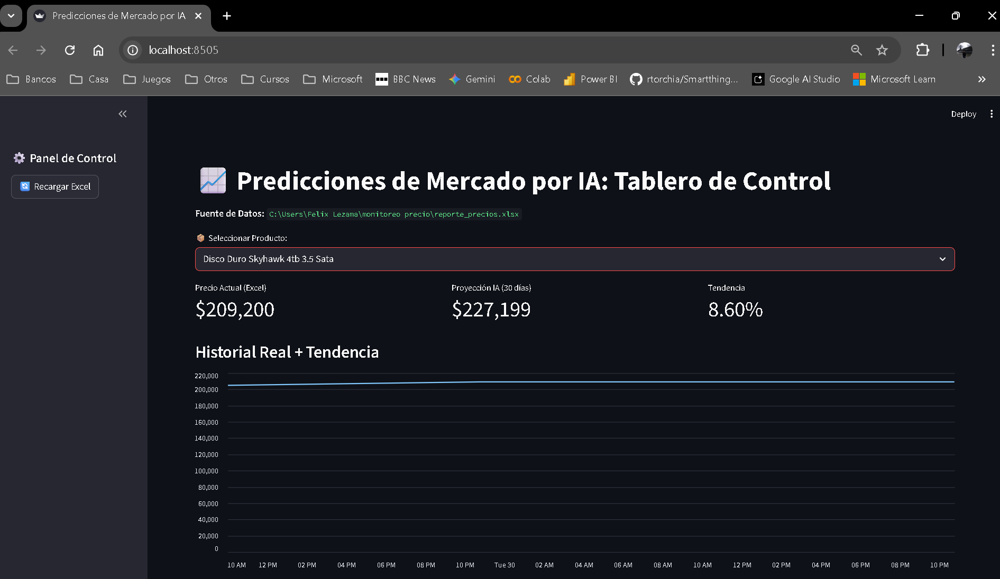

**Sistema de Inteligencia de Mercado y Predicción de Costos basado en Machine Learning.**


## 📋 Descripción

**Predicciones de Mercado por IA** es una solución de Business Intelligence (BI) diseñada para apoyar la toma de decisiones estratégicas en departamentos de Compras y Logística. 

A diferencia de los tableros tradicionales que solo muestran el pasado, este sistema integra un módulo de **Inteligencia Artificial (Regresión Lineal)** que analiza el historial de precios de insumos críticos (Hardware, Infraestructura) y proyecta tendencias futuras a 30 días. Esto permite anticipar subidas de costos y optimizar el momento de compra (Stockpiling).

## 📸 Demo del Dashboard


*(El sistema visualizando la tendencia de precios para infraestructura de red Hikvision)*

## 🛠️ Arquitectura Técnica

El proyecto sigue una **Arquitectura Modular Desacoplada**, separando la lógica de negocio, la ingesta de datos y la visualización para garantizar escalabilidad.

### Estructura de Módulos:

| Archivo | Responsabilidad (Single Responsibility Principle) |
| :--- | :--- |
| **`app.py`** | **Frontend.** Interfaz interactiva construida con Streamlit. Orquesta la visualización de métricas y gráficos. |
| **`loader.py`** | **ETL (Extract, Transform, Load).** Se conecta al sistema de monitoreo local (Excel), normaliza formatos de fecha mixtos y limpia caracteres de moneda. |
| **`predictor.py`** | **Capa de IA.** Contiene el modelo matemático (`LinearRegression`). Recibe datos históricos y devuelve proyecciones financieras. |
| **`config.py`** | **Configuración.** Centraliza rutas de archivos, mapeo de columnas y parámetros globales. |

## 🚀 Instalación y Uso

1. **Clonar el repositorio:**
   ```bash
   git clone [https://github.com/Darkslidex/marketpulse-ai.git](https://github.com/tu-usuario/marketpulse-ai.git)
   cd marketpulse-ai
2. **Instalar dependencias:**
    pip install -r requirements.txt

3. **Configurar Origen de Datos:**
    Editar config.py y ajustar la variable RUTA_ARCHIVO_EXCEL apuntando a su archivo de historial de precios local. Yo usé el excel que me genera este repositorio: https://github.com/Darkslidex/Auditoria-Precios-Security

4. **Ejecutar la Aplicación:** 
    python -m streamlit run app.py


📊 Stack Tecnológico:
Lenguaje: Python 3.
Data Science: Pandas, NumPy.
Machine Learning: Scikit-Learn (Algoritmos de Regresión).
Visualización Web: Streamlit.

Desarrollado por Félix Lezama Mendoza - Project Manager Seguridad Electrónica & Automatización 2025.
